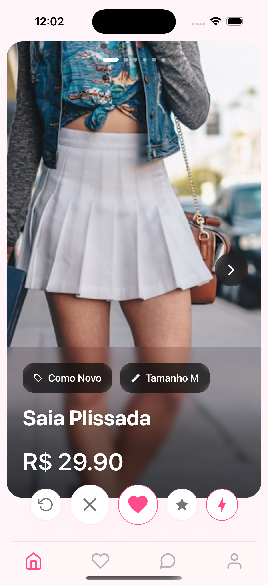
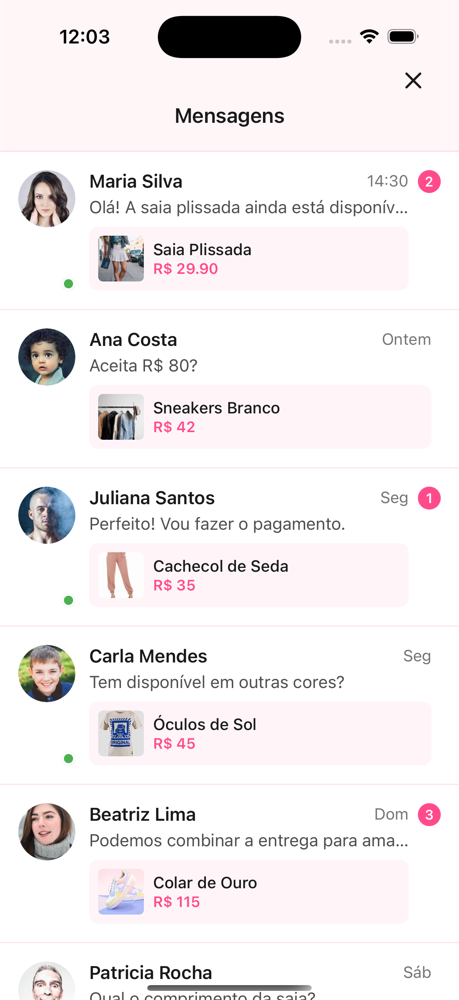
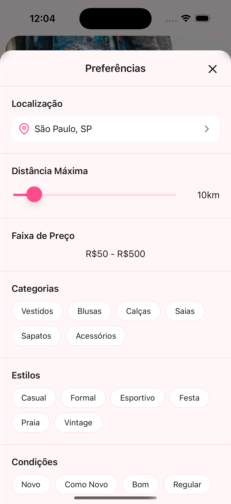
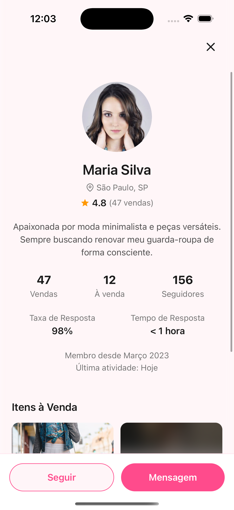
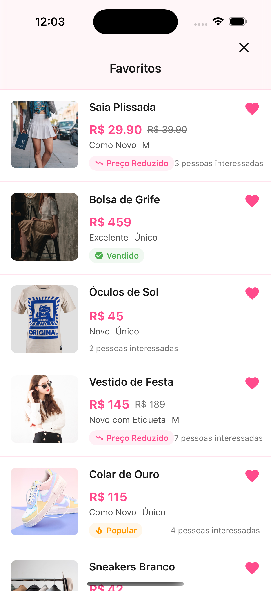
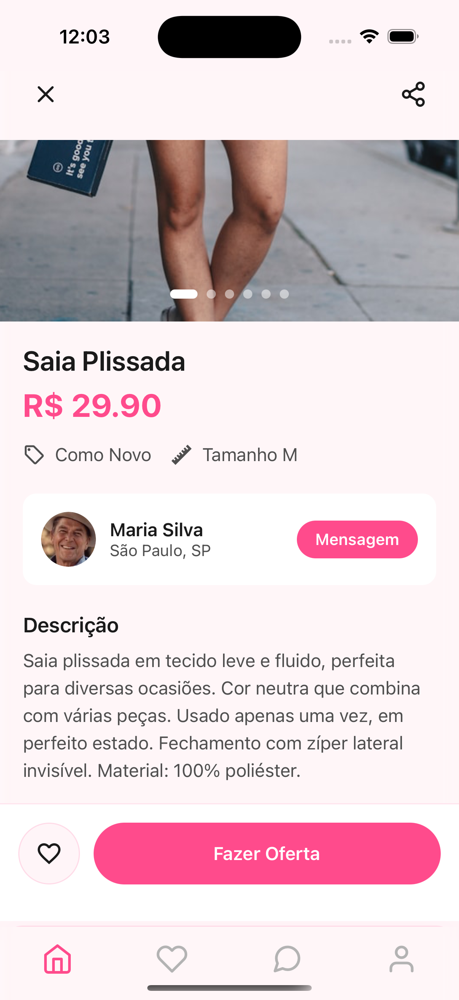

# ClosetMatch: Testing the Waters in Digital Fashion

ClosetMatch started as an experimental prototype to test the market potential for a digital wardrobe management and fashion marketplace platform. This project provided valuable insights into user behavior and market demands in the fashion-tech space.

## The Concept

The idea behind ClosetMatch was to create a comprehensive solution that would combine wardrobe management with a marketplace platform. While many existing apps focus on either aspect, I wanted to explore if combining both features would create more value for users.

## Market Research and Testing

### Campaign Results
I conducted a focused marketing campaign to test market interest, investing R$150 in Instagram ads:
- Generated 30,000 impressions through Instagram ads
- Achieved 2,000 website clicks (cost per click of R$0.075)
- Recorded 17 app download attempts
- Overall cost per potential user: R$8.82

These metrics provided valuable insights into user interest and potential barriers to adoption in the fashion app market. The relatively low cost per click suggested good initial interest, but the conversion rate to downloads indicated significant friction in the user journey.

## Prototype Features

The prototype was designed to test several key features:

### Home Screen Interface 📱
- Tinder-inspired swipe interface for intuitive item discovery
- Swipe right to like items, left to pass
- Match system connecting users with similar style preferences
- Clean, minimalist design focusing on item visuals
- Quick access to core functionalities

### Communication System 💬
- Direct messaging capabilities
- Deal negotiation framework
- Delivery coordination tools

### Personalization Features 🛠️
- Preference settings
- Style matching algorithms
- Location-based discovery

### Trust Building Elements 🌟
- User verification system
- Rating framework
- Transaction history tracking

### Shopping Experience ❤️
- Wishlist functionality
- Price tracking system
- Bookmarking features

### Item Management 🛍️
- Photo upload capability
- Description templates
- Seller information display

## Technical Implementation

The ClosetMatch prototype was developed using React Native, allowing for cross-platform mobile deployment while maintaining native-like performance and user experience. Development was accelerated through the use of Cursor AI, which helped streamline the coding process and implement complex UI patterns.

### Tech Stack Highlights:
- **Frontend Framework**: React Native
- **Development Tools**: Cursor AI
- **UI Components**: Custom components for swipe interactions
- **State Management**: React Context API
- **Navigation**: React Navigation

The choice of React Native enabled rapid prototyping while ensuring the app felt responsive and polished on both iOS and Android platforms. Cursor AI's assistance was particularly valuable in implementing the Tinder-like swipe interface and complex matching algorithms.

## Key Learnings

The project provided several valuable insights:

1. **Market Interest**: While there was initial curiosity (evidenced by the 2,000 website clicks), converting this interest into active users proved challenging.

2. **User Behavior**: The gap between website visits and download attempts (17 downloads from 2,000 clicks) suggested potential barriers in the user adoption journey.

3. **Marketing Efficiency**: The Instagram campaign showed decent engagement rates but highlighted the need for more targeted user acquisition strategies.

## Challenges Encountered

Several key challenges emerged during the market testing phase:

- High user acquisition costs in the fashion app space
- Complex user journey from interest to actual app adoption
- Strong competition from established platforms
- Need for significant marketing investment to achieve critical mass

## Future Possibilities

While the initial market test didn't generate sufficient traction to warrant immediate full-scale development, the project revealed several interesting opportunities:

- Potential for niche market focus
- Integration with existing platforms
- Alternative business models
- Focus on specific user pain points

## Conclusion

While ClosetMatch didn't proceed beyond the prototype and market testing phase, it provided valuable insights into the fashion-tech market. The experience highlighted the importance of thorough market validation before full-scale development and the challenges of user acquisition in the competitive app space.

The project serves as a practical case study in lean startup methodology, demonstrating the value of testing market assumptions early in the development process. These learnings continue to inform future project approaches and market validation strategies.