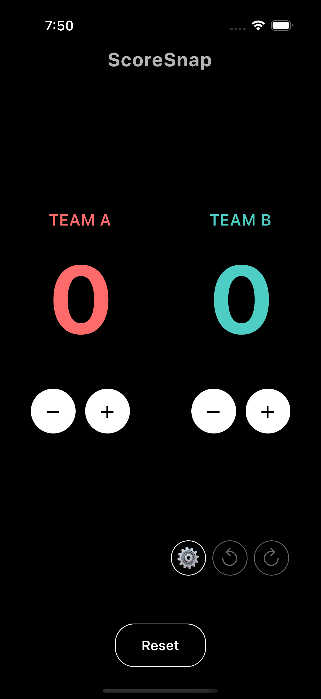
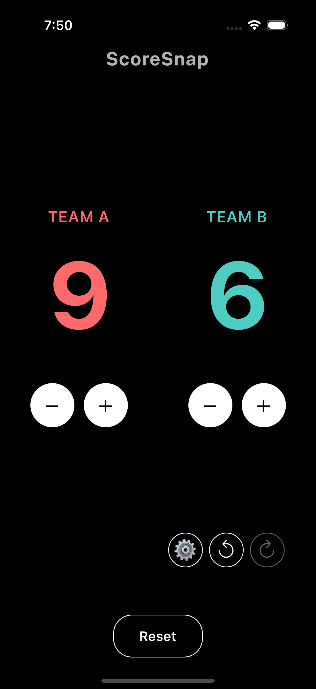
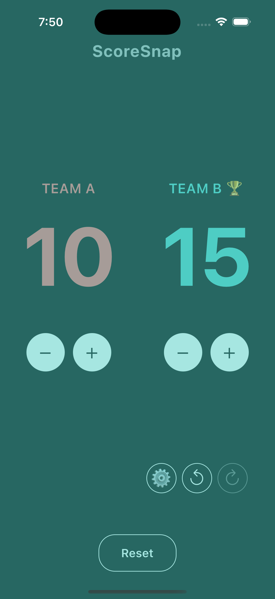
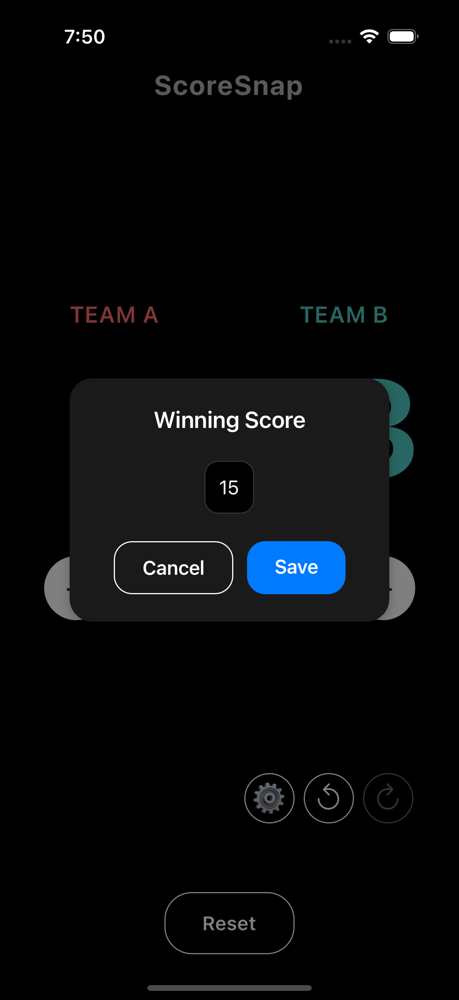

As someone who plays team sports regularly with friends, keeping score during practice matches should be the least of our worries. Yet, it became one of our biggest frustrations. Every existing score tracking app we tried felt like it was fighting against us rather than helping us enjoy the game.

## The Breaking Point

Picture this: It's match point. The rally is intense. Someone finally scores, and I reach for the phone to update the score... only to be greeted by a full-screen ad for mobile games. By the time I dismiss it, we're already arguing about what the score was before the point.

This scenario played out countless times during our volleyball practices. We tried various scoring apps, but they all shared the same problems:

- **Intrusive Ads**: Full-screen ads popping up at crucial moments
- **Complicated UI**: Too many taps needed just to update a simple score
- **Feature Bloat**: Tons of features we never used, making the app slow and confusing
- **Poor Design**: Difficult to read scores from a distance or in outdoor lighting

## Building the Solution

After one particularly frustrating practice session, I decided to build something better. The goal was simple: create a scoring app that I would want to use with my volleyball team.

### Key Features We Actually Need

1. **One-Tap Scoring**
Instead of navigating through menus or dealing with tiny buttons, Snapscore lets you tap anywhere on a team's side to add a point. Swipe down to subtract points if you make a mistake.

2. **Quick Undo/Redo**
We all make mistakes, especially when we're focused on the game. A simple undo/redo feature lets us quickly correct scoring errors without disrupting the flow of the game.

3. **Set Tracking**
Volleyball matches are played in sets, so we built in easy set tracking that remembers scores and automatically suggests starting new sets when needed.

4. **Victory Moments**
When a team wins, we celebrate! Snapscore adds a bit of fun with subtle animations and victory screens that make winning feel special without being over-the-top.

### Clean, Minimal Design

The interface is intentionally minimal. Large, clear numbers that are visible from across the court. High contrast colors that work well outdoors. No clutter, no distractions.

We made sure it works in any orientation because sometimes you need to place your phone sideways on the scorer's table, and sometimes you need to hold it vertically while standing.

### Built for Speed

Every interaction is instant. No loading screens, no delays. When you're in the middle of a game, the last thing you want is to wait for an app to respond.

## The Result

Snapscore has transformed how we keep score during our volleyball practices. No more ads interrupting crucial moments. No more arguing about what the score was. Just clean, simple score tracking that gets out of the way and lets us focus on the game.

The best part? Other players at our local court started asking what app we were using. That's when I knew we had built something special.

## Upcoming Features

- **Team Generator**: Quickly generate balanced teams based on skill levels.
- **Customizable Features**: Choose which features you want to use.
- **Data Privacy**: Your data is handled with the utmost care, and we prioritize privacy in all aspects of the app.

## Try It Yourself

Snapscore is currently in beta and available for both iOS and Android. It's completely free, with no ads and no subscriptions. Because that's how it should be.

If you're tired of dealing with frustrating scoring apps during your practices, give Snapscore a try. I built it for my volleyball team, but it works great for any sport where you need to keep score.

[Sign up for Snapscore](https://scoresnap.emersxw.me)

Let me know what you think! I'm always looking for ways to make it even better for fellow sports enthusiasts. 