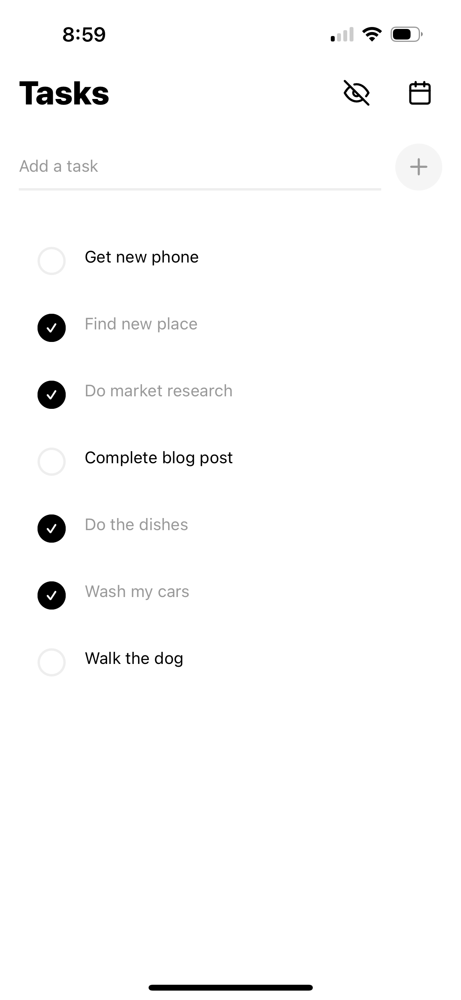

## Why I Created TaskScape

TaskScape was born out of a desire to create a simple yet powerful task management tool that doesn't overwhelm users with unnecessary features. My goal was to develop an app that could seamlessly integrate into users' daily routines, helping them manage their tasks efficiently without getting in the way. This is my first full attempt to publish an app, and I aim to learn more about the process of bringing an app to the Play Store and meeting all the necessary requirements for submission to the Apple App Store, ensuring a wide reach and accessibility for users on both major platforms.

I recognize that the app, in its current form, might be considered too simple for approval. Therefore, I plan to add more features and unique elements to enhance its functionality and appeal. This will not only increase its chances of acceptance but also provide users with a richer experience.

## Features

- **Create and Manage Tasks**: Effortlessly create new tasks and manage them with options to mark tasks as complete or incomplete. TaskScape's minimalist design ensures that you can focus on your tasks without unnecessary distractions.

- **Calendar View for Completed Tasks**: View your completed tasks in a calendar format, providing a visual overview of your productivity over time. This feature is seamlessly integrated, allowing you to reflect on your accomplishments without interrupting your workflow.

- **Track Time Spent on Tasks**: Keep track of the time you spend on each task, helping you manage your time more effectively and identify areas for improvement. TaskScape provides this functionality in a straightforward manner, ensuring it doesn't get in your way.

- **Toggle Completed Tasks Visibility**: Choose to show or hide completed tasks, allowing you to focus on current tasks while still having access to your past accomplishments. This feature is designed to be intuitive, so you can adjust your view with ease.

- **Detailed Task Statistics**: Access detailed statistics about your tasks, offering insights into your productivity patterns and helping you optimize your workflow. TaskScape presents this data clearly, so you can make informed decisions without being overwhelmed.

- **Smooth Animations and Transitions**: Enjoy a seamless user experience with smooth animations and transitions that make navigating the app intuitive and enjoyable. These elements are crafted to enhance usability without being intrusive.

- **Persistent Storage**: Rest assured that your tasks and data are securely stored, even if you close the app, ensuring that you never lose important information. TaskScape's storage solution is reliable and unobtrusive, keeping your data safe without complicating your experience.

## App Review Status

This screenshot shows TaskScape currently awaiting review. As part of my learning journey, I am eager to understand the review process and make any necessary adjustments to meet the app store requirements.

